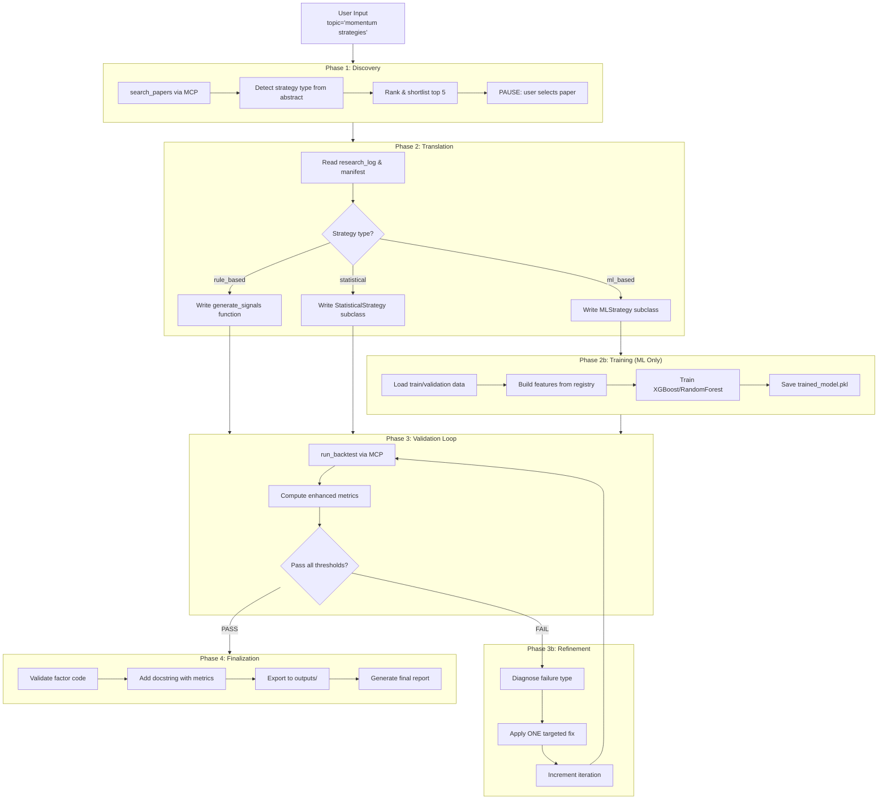

# Paper-to-Factor Pipeline

An autonomous quantitative research workflow that turns a research topic into an implementable trading factor. It discovers relevant arXiv papers, translates paper logic into executable Python code (supporting rule-based, ML-based, statistical, and ensemble strategies), backtests with transaction costs and survivorship-aware data handling, compares performance against SPY and ML baselines, iteratively refines hypotheses, and exports a validated final factor module.

---

## 1. Overview

The workflow is designed to run inside Claude Code using **Claude Code skills** (structured markdown instruction files) and **MCP servers**:

1. Discover relevant papers on arXiv for a user-supplied topic.
2. Let the user choose one paper from the ranked shortlist.
3. **Detect strategy type** from the paper (rule-based, ML-based, statistical, or ensemble).
4. Translate the paper's signal into executable Python (function or class-based).
5. **Train ML models** if the strategy requires it.
6. Backtest the generated factor on historical data with survivorship-aware handling.
7. Compare results against:
   - SPY buy-and-hold
   - XGBoost baseline
   - Logistic Regression baseline
8. Refine the hypothesis if validation thresholds are not met.
9. Export the validated result to `outputs/final_factor.py`.

### Supported Strategy Types

| Type | Description | Example |
|------|-------------|---------|
| **rule_based** | Formula-based signals (momentum, mean-reversion, RSI) | Cross-sectional 12-1 momentum |
| **ml_based** | Machine learning models (XGBoost, Random Forest) | Return prediction classifier |
| **statistical** | Time-series models (ARIMA, GARCH, cointegration) | Pairs trading spread |
| **ensemble** | Combination of multiple strategies | Rank-average momentum + mean-reversion |

---

## Sample Run

> **Disclaimer:** The following is an example output from a sample pipeline run on limited test.

**[View Sample Report →](https://natbrian.github.io/auto-research-finance/paper-to-factor-pipeline/outputs/example_2/FINAL_REPORT)**

Sample run validates the Jegadeesh & Titman (1993) momentum paper — Sharpe 1.26, +19.4% annual return, with full quintile analysis, ML baseline comparison, and theoretical validation against the paper's original claims.

---

## 2. Architecture



---

## 3. Skills Reference

The pipeline consists of 6 Claude Code skills. One orchestrator skill coordinates the entire workflow, while 5 individual skills can be run independently for specific tasks.

### Skill Overview

| Skill | Purpose | Trigger Phrases |
|-------|---------|-----------------|
| **paper-to-alpha** | Main orchestrator - runs full pipeline | "run the pipeline", "start research", "paper to alpha" |
| **paper-discovery** | Search arXiv for relevant papers | "find papers", "search arXiv", "discover papers" |
| **factor-translate** | Convert paper to executable code | "translate the paper", "write the factor", "implement the formula" |
| **model-train** | Train ML models for strategies | "train model", "fit model", "train the strategy" |
| **run-tearsheet** | Execute backtest and show results | "run backtest", "run tearsheet", "check performance" |
| **hypothesis-refine** | Diagnose and fix backtest issues | "refine hypothesis", "fix the backtest", "improve Sharpe" |
| **generate-report** | Generate comprehensive final report | "generate report", "create final report", "make the report" |

---

### Running the Full Pipeline (Orchestrator)

The `paper-to-alpha` skill orchestrates all phases automatically. Start MCP servers first, then invoke:

```
/paper-to-alpha --param topic="momentum strategies"
```

The orchestrator will:
1. Call `paper-discovery` to find and rank papers
2. Pause for user selection
3. Call `factor-translate` to write code
4. Call `model-train` if ML-based (skipped for rule-based)
5. Loop: call `run-tearsheet` → `hypothesis-refine` until success or max iterations
6. Export final factor to `outputs/`
7. Call `generate-report` to create comprehensive final report

---

### Running Individual Skills

You can run each skill independently for debugging, testing, or manual control.

#### paper-discovery (Standalone)

Search arXiv without running the full pipeline:

```
/paper-discovery --param topic="mean reversion strategies"
```

**Output:** Presents top 5 papers with detected strategy types. User selects one. Writes selected paper metadata to `sandbox/research_log.md`.

---

#### factor-translate (Standalone)

Translate a paper that's already been selected:

```
/factor-translate
```

**Prerequisites:**
- `sandbox/research_log.md` must contain selected paper metadata
- `strategy_type` must be set (rule_based, ml_based, statistical)

**Output:** Writes `sandbox/factor.py` with appropriate strategy implementation.

---

#### model-train (Standalone)

Train an ML strategy that's already been translated:

```
/model-train
```

**Prerequisites:**
- `sandbox/factor.py` must contain an `MLStrategy` subclass
- `sandbox/research_log.md` must have `strategy_type: ml_based`

**Output:**
- Trains model on historical data
- Saves to `sandbox/models/trained_model.pkl`
- Updates `research_log.md` with hyperparameters and feature importance

---

#### run-tearsheet (Standalone)

Run a backtest on the current factor:

```
/run-tearsheet
```

**Prerequisites:**
- `sandbox/factor.py` must exist and be valid
- For ML strategies: model must be fitted (`is_fitted: true` in research_log)

**Output:** Displays formatted tearsheet with all metrics and updates `sandbox/research_log.md`.

---

#### hypothesis-refine (Standalone)

Diagnose and fix the current factor after a failed backtest:

```
/hypothesis-refine
```

**Prerequisites:**
- `sandbox/research_log.md` must contain "Last Backtest Result" and "Last Error"

**Output:** Modifies `sandbox/factor.py` with exactly one targeted fix based on failure type.

---

#### generate-report (Standalone)

Generate a comprehensive final report after pipeline completion:

```
/generate-report
```

**Prerequisites:**
- `sandbox/research_log.md` must contain paper metadata and pipeline state
- Backtest should have been run (if not, will run automatically)

**Output:** Generates the following files in `outputs/`:
- `FINAL_REPORT.md` - Comprehensive markdown report with:
  - Executive summary with paper information
  - Paper implementation details
  - Performance metrics comparison (Strategy vs ML vs SPY)
  - Backtest visualizations (equity curves, drawdown, Sharpe comparison)
  - Implementation files and quick start guide
  - Technical notes and limitations
- `backtest_charts.png` - 4-panel visualization charts
- `backtest_result.json` - Full metrics in JSON format

---

### Workflow Examples

#### Example 1: Full Automated Pipeline
```
User: Run the pipeline on volatility risk premium

Claude: [runs paper-to-alpha orchestrator]
        → discovers papers
        → pauses for selection
        → translates paper
        → (if ML) trains model
        → backtests and refines
        → exports final factor
        → generates comprehensive report
```

#### Example 2: Manual Step-by-Step
```
User: Find papers on pairs trading
Claude: [runs paper-discovery, presents 5 papers]
User: I'll take paper 2
Claude: [records selection in research_log.md]

User: Translate that paper
Claude: [runs factor-translate, writes sandbox/factor.py]

User: Run the backtest
Claude: [runs run-tearsheet, shows results]

User: The Sharpe is too low, fix it
Claude: [runs hypothesis-refine, applies one fix]

User: Run backtest again
Claude: [runs run-tearsheet, shows improved results]
```

#### Example 3: ML Strategy Development
```
User: Search for machine learning return prediction papers
Claude: [runs paper-discovery, presents papers with ml_based type]

User: Select paper 3
Claude: [records selection]

User: Translate and train the model
Claude: [runs factor-translate → writes MLStrategy subclass]
        [runs model-train → fits XGBoost, saves model]

User: Check performance
Claude: [runs run-tearsheet, shows metrics + feature importance]
```

#### Example 4: Generate Report After Manual Work
```
User: I've manually refined the factor, run a backtest
Claude: [runs run-tearsheet, shows results]

User: Looks good, generate the final report
Claude: [runs generate-report]
        → creates FINAL_REPORT.md with all sections
        → generates backtest_charts.png visualizations
        → saves backtest_result.json
```

---

## 4. Project Structure

```
paper-to-factor-pipeline/
├── .claude/
│   └── skills/
│       ├── paper-discovery/SKILL.md      # arXiv paper search
│       ├── factor-translate/SKILL.md     # Paper to code translation
│       ├── model-train/SKILL.md          # ML model training
│       ├── run-tearsheet/SKILL.md        # Backtest execution
│       ├── hypothesis-refine/SKILL.md    # Strategy refinement
│       ├── generate-report/SKILL.md      # Final report generation
│       └── paper-to-alpha/SKILL.md       # Main orchestrator
├── config/
│   └── settings.yaml                     # Pipeline configuration
├── data/
│   ├── manifest.json                     # Data schema
│   └── universe_sp500_historical.csv     # S&P 500 historical membership
├── mcp_servers/
│   ├── arxiv_server/server.py            # arXiv MCP server
│   └── backtest_server/server.py         # Backtest MCP server
├── sandbox/
│   ├── factor.py                         # Working factor file
│   ├── research_log.md                   # Pipeline state
│   └── models/                           # Trained ML models
├── src/
│   ├── core/                             # Core infrastructure
│   │   ├── base.py                       # BaseStrategy, RuleBasedStrategy, MLStrategy
│   │   ├── metrics.py                    # Enhanced metrics (Sharpe, Sortino, Calmar, IC)
│   │   ├── execution_model.py            # Transaction costs, position sizing
│   │   ├── sector_data.py                # GICS sector mappings
│   │   ├── feature_registry.py           # Extensible feature engineering
│   │   └── backtester.py                 # EnhancedBacktester
│   ├── strategies/                       # Strategy implementations
│   │   ├── rule_based.py                 # Momentum, MeanReversion, RSI factors
│   │   ├── ml_strategy.py                # TreeBasedStrategy (XGBoost/RF)
│   │   └── ensemble.py                   # EnsembleStrategy, StackingEnsemble
│   ├── backtester.py                     # Legacy backtester (backward compatible)
│   ├── ml_baseline.py                    # ML baseline comparison
│   ├── prepare.py                        # Data loading with survivorship handling
│   ├── validator.py                      # Factor validation
│   ├── report_generator.py               # Final report generation
│   └── utils.py                          # Utilities
├── tests/                                # Test suite
├── outputs/                              # Final deliverables
└── README.md
```

---

## 5. Quick Start

### 4.1 Prerequisites

| Requirement | Version | Notes |
|---|---|---|
| Python | 3.10+ | Required for pandas 2.x and type hints |
| Claude Code CLI | Current | Required for skill orchestration |
| Git | Any recent version | To clone the repo |
| Internet access | Required | Needed for arXiv and yfinance downloads |

### 4.2 Clone & Install

```bash
# 1. Clone the repository
git clone https://github.com/NatBrian/auto-research-finance.git
cd paper-to-factor-pipeline

# 2. Create and activate a virtual environment
python -m venv .venv

# macOS / Linux
source .venv/bin/activate

# Windows PowerShell
.venv\Scripts\Activate.ps1

# 3. Install dependencies + the local package
pip install -r requirements.txt
pip install -e .
```

### 4.3 Configure Claude Code

This pipeline uses **Claude Code skills** and **MCP servers**. Follow these steps carefully.

#### Step 1 — Install the skills into Claude Code

You have two choices for where to put the skills:

**Option A — Project-local (skills only available when working in this repo)**

Copy the `.claude/skills` directory into this repo's root (already done if you cloned this repo). Claude Code automatically picks up `.claude/skills/` when launched from the project root.

**Option B — Global (skills available in all Claude Code sessions)**

Copy the skills to your global Claude Code config:

```powershell
# Windows (PowerShell)
Copy-Item -Recurse .claude\skills $HOME\.claude\
```

```bash
# macOS / Linux
cp -r .claude/skills ~/.claude/
```

After copying, verify the structure:
```bash
# You should see one folder per skill, each containing SKILL.md
ls ~/.claude/skills/          # macOS / Linux
ls $HOME\.claude\skills\      # Windows
```

#### Step 2 — Configure MCP servers

Merge the MCP server entries from this repo's `.claude.json` into your project's `.claude.json` (or `~/.claude/settings.json`):

```json
{
  "mcpServers": {
    "arxiv": {
      "command": "python",
      "args": ["path/to/paper-to-factor-pipeline/mcp_servers/arxiv_server/server.py"]
    },
    "backtest": {
      "command": "python",
      "args": ["path/to/paper-to-factor-pipeline/mcp_servers/backtest_server/server.py"]
    }
  }
}
```

Make sure the `args` paths point to the **actual location** of this repo on your filesystem.

#### Step 3 — Troubleshooting skills not loading

If skills do not appear in Claude Code's "Available skills" list:

1. **Check file naming:** The file must be named `SKILL.md` (all caps), not `skill.md` or any other variation.
2. **Check folder structure:** Each skill must be in its own subfolder: `.claude/skills/<skill-name>/SKILL.md`.
3. **Check YAML frontmatter:** Each `SKILL.md` must start with a valid YAML block containing at minimum `name` and `description` fields.
4. **Check description clarity:** Claude Code decides whether to load a skill **solely based on the `description` field**. If your prompt does not semantically match the description, the skill won't load. Include common trigger phrases in the description (e.g. "run backtest", "find papers", "translate the paper").
5. **Verify permissions (Windows):** Make sure Claude Code has read access to the skills directory.

### 4.4 Run the Pipeline

Launch Claude Code from the repo root (make sure the venv is active):

```bash
claude
```

Then, inside the Claude Code session, invoke the orchestrator skill:

```
/paper-to-alpha --param topic="momentum strategies"
```

Example topics:

- `cross-sectional momentum`
- `mean reversion`
- `volatility risk premium`
- `pairs trading`
- `machine learning return prediction`

The pipeline will:

1. **Discover** papers on arXiv and present a ranked shortlist of 5 with detected strategy types.
2. **Pause** and ask you to select one paper.
3. **Translate** the paper's signal logic into `sandbox/factor.py`.
4. **Train** the model if it's an ML-based strategy.
5. **Backtest** with an automated validation loop (up to 3 refinement iterations).
6. **Export** a validated factor to `outputs/final_factor.py`.

### 4.6 Running Tests

```bash
pytest tests/ -v
```

---

## 6. Output

### `outputs/final_factor.py`

This is the final deliverable. It contains:

- A production-oriented strategy implementation (function or class-based)
- A module docstring with paper metadata
- The final validation summary metrics
- For ML strategies: feature importance ranking

### `outputs/FINAL_REPORT.md`

A comprehensive markdown report containing:

1. **Executive Summary** - Paper info, key results, conclusion
2. **Paper Implementation Details** - Source paper, formula, architecture
3. **Performance Metrics Comparison** - Strategy vs ML baseline vs SPY
4. **Backtest Visualizations** - Equity curves, drawdown, Sharpe comparison, risk-return profile
5. **Implementation Files** - Quick start guide, file structure, usage examples
6. **Technical Notes** - Limitations, validation checklist, recommendations

### `outputs/backtest_charts.png`

4-panel visualization showing:
- Equity curves comparison (Strategy vs ML vs SPY)
- Strategy drawdown profile
- Sharpe ratio comparison bar chart
- Risk-return scatter plot

### `outputs/backtest_result.json`

Full backtest metrics in JSON format for programmatic access.

### `outputs/final_model.pkl`

For ML-based strategies, this contains the trained model with:
- Trained classifier (XGBoost/RandomForest)
- Fitted scaler
- Hyperparameters used
- Feature names and importance scores

### `sandbox/research_log.md`

This is the pipeline state file used by the skill workflow. It tracks:

- Current phase and iteration
- Selected paper metadata
- Strategy type and configuration
- Hyperparameters and feature set
- Performance history with enhanced metrics
- Sector exposure breakdown
- Feature importance (for ML)
- Last backtest result
- Last error
- Refinement actions taken
- Final decision

> **Note:** The skill files (`.claude/skills/*/SKILL.md`) are **not modified** during pipeline execution. All state is written to `sandbox/research_log.md` and `sandbox/factor.py`.

---

## 7. Configuration

`config/settings.yaml` controls data loading, execution assumptions, validation thresholds, ML configuration, and workflow paths.

### Data & Execution

| Key | Meaning |
|---|---|
| `data.start_date` | Historical data start date |
| `data.end_date` | Historical data end date |
| `data.train_ratio` | Fraction of dates used for model training |
| `data.validation_ratio` | Fraction of dates used for validation split |
| `data.test_ratio` | Fraction of dates used for test split |
| `data.universe_file` | Historical universe membership CSV |
| `execution.transaction_cost_bps` | Transaction cost in basis points |
| `execution.max_position_weight` | Maximum weight for single position |
| `execution.max_leverage` | Maximum gross leverage |

### Validation Thresholds

| Key | Meaning |
|---|---|
| `thresholds.min_sharpe` | Minimum Sharpe ratio |
| `thresholds.min_ic` | Minimum information coefficient |
| `thresholds.min_sortino` | Minimum Sortino ratio |
| `thresholds.max_beta` | Maximum beta to SPY |
| `thresholds.require_positive_alpha` | Require positive alpha versus SPY |

### ML Configuration

| Key | Meaning |
|---|---|
| `ml.default_model` | Default model type (xgboost, random_forest) |
| `ml.default_features` | Features for ML baseline |
| `ml.extended_features` | Extended feature set for sophisticated models |
| `ml.target_horizon` | Forward return prediction horizon (days) |
| `ml.tune_hyperparams` | Enable cross-validation tuning |
| `ml.xgboost.*` | XGBoost hyperparameters |
| `ml.random_forest.*` | Random Forest hyperparameters |

### Ensemble Configuration

| Key | Meaning |
|---|---|
| `ensemble.enabled` | Enable ensemble strategies |
| `ensemble.default_method` | Combination method (mean, rank_average, weighted, stacking) |

### Sector Tracking

| Key | Meaning |
|---|---|
| `sector.enabled` | Enable sector exposure tracking |
| `sector.sector_map_file` | Path to sector mappings CSV |
| `sector.max_sector_concentration` | Maximum weight in single sector |

---

## 8. Feature Registry

The pipeline includes an extensible feature registry for ML strategies. Available features:

### Momentum Features
- `ret_1d`, `ret_5d`, `ret_20d`, `ret_60d`, `ret_252d`
- `momentum_12_1` (12-month momentum skipping most recent month)

### Volatility Features
- `volatility_5d`, `volatility_20d`, `volatility_60d`
- `vol_ratio_20_5` (volatility regime indicator)

### Volume Features
- `vol_z_5d`, `vol_z_20d` (volume z-scores)
- `volume_ratio`, `adv_20d` (average dollar volume)

### Technical Features
- `rsi_14d` (Relative Strength Index)
- `bb_position` (Bollinger Band position)
- `atr_ratio` (Average True Range)
- `gap`, `intraday_range`, `close_to_open`

### Usage

```python
from src.core.feature_registry import FeatureRegistry, DEFAULT_FEATURES, EXTENDED_FEATURES

# Build default features
features = FeatureRegistry.build_features(data, DEFAULT_FEATURES)

# Build specific features
features = FeatureRegistry.build_features(data, ["ret_5d", "volatility_20d", "rsi_14d"])

# List all available features
all_features = FeatureRegistry.list_features()
```

---

## 9. Metrics & Benchmarks

The backtest loop reports comprehensive metrics:

### Risk-Adjusted Performance
- **Sharpe Ratio** - Annualized return per unit of volatility
- **Sortino Ratio** - Annualized return per unit of downside volatility
- **Calmar Ratio** - Annualized return divided by maximum drawdown
- **Information Coefficient** - Mean Spearman correlation between signals and forward returns

### Returns & Risk
- **Annualized Return** - Geometric average annual return
- **Maximum Drawdown** - Peak-to-trough decline
- **Daily Turnover** - Average portfolio turnover

### Directional Accuracy
- **Hit Rate** - Percentage of correct directional predictions
- **Profit Factor** - Gross profits divided by gross losses

### Benchmark Comparison
- **Alpha vs SPY** - Strategy return minus SPY buy-and-hold
- **Beta to SPY** - Systematic risk exposure
- **vs XGBoost Baseline** - Comparison to default ML model
- **vs Logistic Regression** - Comparison to linear baseline

### Sector Exposure
- **Top Sector** - Highest weighted sector
- **Sector Concentration** - Herfindahl index
- **Sector Breakdown** - Weight by GICS sector

---

## 10. Data Integrity Notes

The loader is intentionally survivorship-aware:

- The active universe includes only tickers that were already in the universe at the chosen start date and not removed before that date.
- If a ticker has partial real history, the loader preserves observed data and injects `NaN` values after the last valid date to model delisting-style disappearance.
- If a ticker returns zero coverage despite being active at the start, the loader synthesizes a deterministic pre-delisting history and then transitions to `NaN`.
- When an actual `Date_Removed` exists in the universe file, that date is used to place the synthetic delisting tail when possible.
- Forward filling is capped at 5 business days so short operational gaps are tolerated without hiding long absences.

---

## 11. Extending the Pipeline

### Adding New Features

Register custom features using the decorator pattern:

```python
from src.core.feature_registry import FeatureRegistry

@FeatureRegistry.register("my_custom_feature", category="custom")
def my_custom_feature(data: pd.DataFrame) -> pd.Series:
    close = data["Close"].astype(float)
    # Your feature logic here
    return feature_series
```

### Creating Custom Strategies

**Rule-Based:**
```python
from src.strategies.base import RuleBasedStrategy

class MyFactor(RuleBasedStrategy):
    def __init__(self, lookback: int = 20):
        super().__init__()
        self._lookback = lookback

    def generate_signals(self, data: pd.DataFrame) -> pd.Series:
        self.validate_data(data)
        # Your signal logic here
        return signals
```

**ML-Based:**
```python
from src.strategies.base import MLStrategy
from src.core.feature_registry import FeatureRegistry

class MyMLStrategy(MLStrategy):
    def _build_features(self, data: pd.DataFrame) -> pd.DataFrame:
        return FeatureRegistry.build_features(data, ["ret_5d", "volatility_20d"])

    def _build_target(self, data: pd.DataFrame) -> pd.Series:
        close = data["Close"].astype(float)
        return close.groupby(level="ticker").shift(-5) / close - 1.0

    def fit(self, train_data, val_data=None):
        # Training logic
        self._is_fitted = True
        return self

    def generate_signals(self, data: pd.DataFrame) -> pd.Series:
        self.validate_data(data)
        # Signal generation logic
        return signals
```

---

## 12. Limitations

- `yfinance` data quality and symbol coverage can vary.
- arXiv retrieval is metadata and abstract driven; PDF parsing is not included in this version.
- Synthetic delisting tails are a pragmatic approximation, not a CRSP-grade replacement.
- The included universe file is intentionally small and illustrative rather than a complete institutional research dataset.
- ML strategies require sufficient training data; very short backtest periods may not produce reliable models.