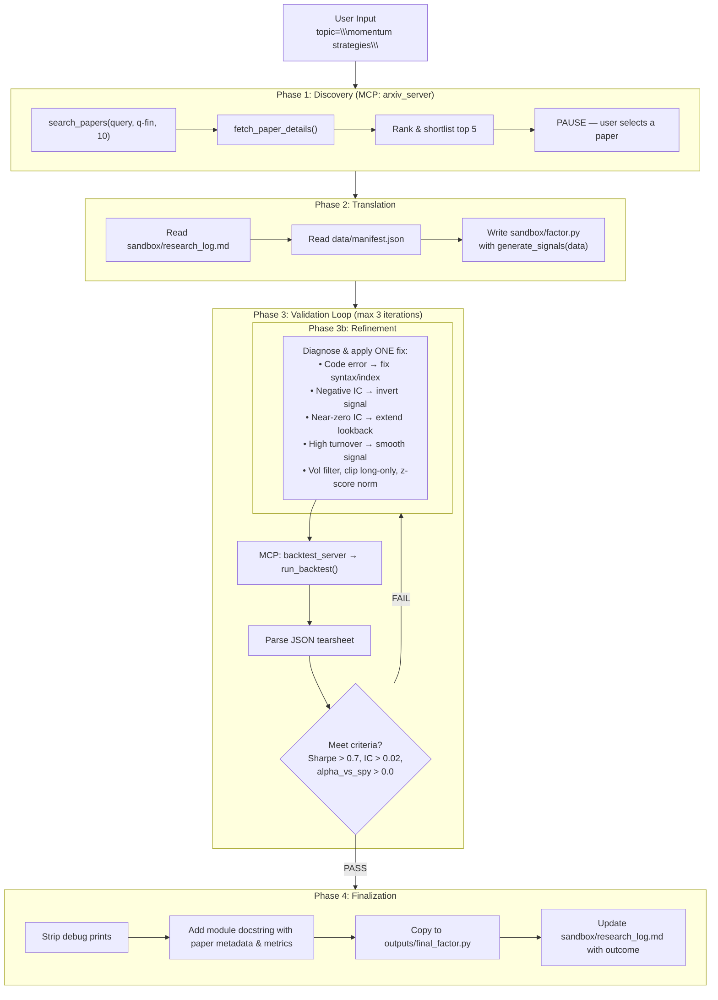

# Paper-to-Factor Pipeline

An autonomous quantitative research workflow that turns a research topic into an implementable trading factor. It discovers relevant arXiv papers, translates paper logic into a `generate_signals` function, backtests with transaction costs and survivorship-aware data handling, compares performance against SPY and ML baselines, iteratively refines hypotheses, and exports a validated final factor module.

---

## 1. Overview

The workflow is designed to run inside Claude Code using Markdown skill files and MCP servers:

1. Discover relevant papers on arXiv for a user-supplied topic.
2. Let the user choose one paper from the ranked shortlist.
3. Translate the paper's mathematical signal into executable Python.
4. Backtest the generated factor on historical data with survivorship-aware handling.
5. Compare results against:
   - SPY buy-and-hold
   - XGBoost baseline
   - Logistic Regression baseline
6. Refine the hypothesis if validation thresholds are not met.
7. Export the validated result to `outputs/final_factor.py`.

The repo ships with a tracked placeholder `sandbox/factor.py` so the pipeline and tests have a stable working file before the translation step rewrites it.

---

## 2. Architecture



---

## 3. Quick Start

### 3.1 Prerequisites

| Requirement | Version | Notes |
|---|---|---|
| Python | 3.10+ | Required for pandas 2.x and type hints |
| Claude Code CLI | Current | Required for skill orchestration |
| Git | Any recent version | To clone the repo |
| Internet access | Required | Needed for arXiv and yfinance downloads |

### 3.2 Clone & Install

```bash
# 1. Clone the repository
git clone 
cd paper-to-factor-pipeline

# 2. Create and activate a virtual environment
python -m venv .venv

# macOS / Linux
source .venv/bin/activate

# Windows PowerShell
.venv\Scripts\Activate.ps1

# 3. Install dependencies + the local package
pip install -r requirements.txt
pip install -e .
```

### 3.3 Configure Claude Code

This pipeline uses **Claude Code skills** and **MCP servers**. There are two ways to wire them up.

#### Option A — Run from inside the repo directory (Recommended)

Claude Code automatically reads `.claude.json` and `.claude/skills/` when you launch it from the project root. No manual copying is needed.

```bash
# Make sure your venv is still active, then:
claude
```

Inside the Claude Code session, run:

```
claude run-skill paper-to-alpha --param topic="momentum strategies"
```

#### Option B — Link the skills into an existing Claude Code project

If you want to use this pipeline from another project directory:

1. Copy the skills folder into your project's `.claude/` directory:
   ```bash
   cp -r .claude/skills /path/to/your-project/.claude/
   ```

2. Merge the MCP server entries from this repo's `.claude.json` into your project's `.claude.json` (or `~/.claude/settings.json`):
   ```json
   {
     "mcpServers": {
       "arxiv": {
         "command": "python",
         "args": ["path/to/paper-to-factor-pipeline/mcp_servers/arxiv_server/server.py"]
       },
       "backtest": {
         "command": "python",
         "args": ["path/to/paper-to-factor-pipeline/mcp_servers/backtest_server/server.py"]
       }
     }
   }
   ```
   Make sure the `args` paths point to the **actual location** of this repo on your filesystem.

### 3.4 Start the MCP Servers

The two MCP servers must be running **before** you invoke the skill. Open two terminals and run each from the project root:

**Terminal 1 — arXiv server**
```bash
# Make sure the venv is active
python mcp_servers/arxiv_server/server.py
```

**Terminal 2 — Backtest server**
```bash
# Make sure the venv is active
python mcp_servers/backtest_server/server.py
```

Both servers use stdio transport and will wait for Claude Code to connect.

> **Tip:** If the orchestrator's pre-flight check reports that a server is unreachable, verify that:
> 1. Both server processes are still running (not crashed).
> 2. The `python` executable in `.claude.json` resolves to the same venv where you installed the dependencies.
> 3. You are running Claude Code from the repo root so `.claude.json` is picked up automatically.

### 3.5 Run the Pipeline

```bash
claude run-skill paper-to-alpha --param topic="momentum strategies"
```

Example topics:

- `cross-sectional momentum`
- `mean reversion`
- `volatility risk premium`
- `pairs trading`

The pipeline will:

1. **Discover** papers on arXiv and present a ranked shortlist of 5.
2. **Pause** and ask you to select one paper.
3. **Translate** the paper's signal logic into `sandbox/factor.py`.
4. **Backtest** with an automated validation loop (up to 3 refinement iterations).
5. **Export** a validated factor to `outputs/final_factor.py`.

### 3.6 Running Tests

```bash
pytest tests/ -v
```

---

## 4. Output

### `outputs/final_factor.py`

This is the final deliverable. It contains:

- a production-oriented `generate_signals(data)` implementation
- a module docstring with paper metadata
- the final validation summary metrics

### `sandbox/research_log.md`

This is the pipeline state file used by the skill workflow. It tracks:

- current phase and iteration
- selected paper metadata
- performance history
- last backtest result
- last error
- refinement actions taken
- final decision

---

## 5. Configuration

`config/settings.yaml` controls data loading, execution assumptions, validation thresholds, and workflow paths.

| Key | Meaning |
|---|---|
| `data.start_date` | Historical data start date |
| `data.end_date` | Historical data end date |
| `data.train_ratio` | Fraction of dates used for model training |
| `data.validation_ratio` | Fraction of dates used for validation split |
| `data.test_ratio` | Fraction of dates used for test split |
| `data.universe_file` | Historical universe membership CSV |
| `data.manifest_file` | Data schema manifest path |
| `data.min_coverage_ratio` | Minimum acceptable real-history coverage before delisting handling |
| `execution.transaction_cost_bps` | Transaction cost in basis points |
| `execution.max_position_weight` | Informational cap hint for generated factors |
| `backtest.risk_free_rate` | Risk-free rate used in Sharpe computation |
| `backtest.periods_per_year` | Annualization factor, typically `252` |
| `thresholds.min_sharpe` | Minimum Sharpe threshold |
| `thresholds.min_ic` | Minimum information coefficient threshold |
| `thresholds.require_positive_alpha` | Require positive alpha versus SPY |
| `workflow.max_iterations` | Maximum refinement iterations |
| `workflow.research_log_path` | Workflow state file |
| `workflow.factor_path` | Working factor path |
| `workflow.output_path` | Final exported factor path |

---

## 6. Data Integrity Notes

The loader is intentionally survivorship-aware:

- The active universe includes only tickers that were already in the universe at the chosen start date and not removed before that date.
- If a ticker has partial real history, the loader preserves observed data and injects `NaN` values after the last valid date to model delisting-style disappearance.
- If a ticker returns zero coverage despite being active at the start, the loader synthesizes a deterministic pre-delisting history and then transitions to `NaN`.
- When an actual `Date_Removed` exists in the universe file, that date is used to place the synthetic delisting tail when possible.
- Forward filling is capped at 5 business days so short operational gaps are tolerated without hiding long absences.

---

## 7. Benchmarks And Validation

The backtest loop reports:

- strategy Sharpe ratio
- information coefficient
- annualized return
- max drawdown
- daily turnover
- alpha versus SPY
- XGBoost Sharpe
- Logistic Regression Sharpe

Annualized returns are computed on a consistent simple-return basis across the strategy, SPY benchmark, and ML baseline outputs.

---

## 8. Limitations

- `yfinance` data quality and symbol coverage can vary.
- arXiv retrieval is metadata and abstract driven; PDF parsing is not included in this version.
- Synthetic delisting tails are a pragmatic approximation, not a CRSP-grade replacement.
- The included universe file is intentionally small and illustrative rather than a complete institutional research dataset.
