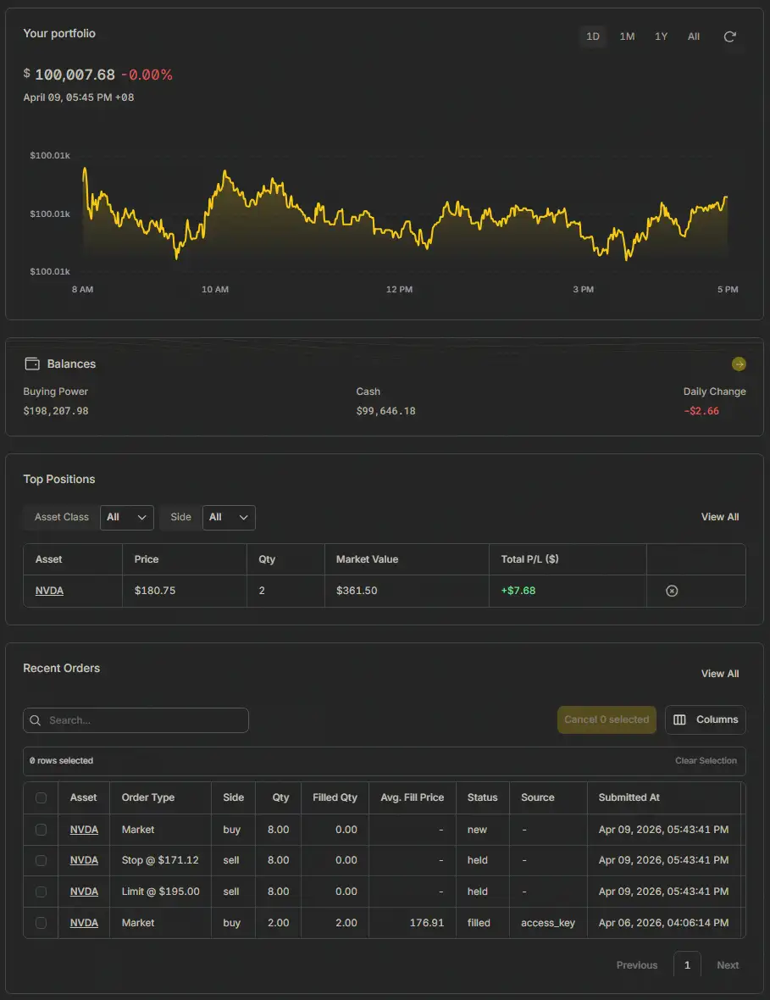

# Trading Session



## Session Info
- **session_id**: NVDA_2026-04-09_1775720838
- **ticker**: NVDA
- **analysis_date**: 2026-04-09
- **phase**: ORDER_SUBMITTED
- **status**: COMPLETE
- **started_at**: 2026-04-09 07:47:18
- **completed_at**: 2026-04-09T08:40:12Z

## Configuration
- **exchange_adapter**: alpaca
- **debate_rounds**: 2
- **risk_debate_rounds**: 2
- **max_position_size_pct**: 10.0
- **portfolio_value**: 100098.94

## Fundamentals Report
```json
{
  "agent": "FundamentalsAnalyst",
  "ticker": "NVDA",
  "analysis_date": "2026-04-09",
  "scores": {
    "profitability": {
      "score": 5,
      "notes": "Exceptional margins: Gross margin 71.1%, Operating margin 60.4%, ROE 76.4%. Industry-leading profitability with improving trends over 4 quarters."
    },
    "growth": {
      "score": 5,
      "notes": "Revenue grew 65.5% YoY to $215.9B, EPS grew 67% YoY to $4.90, FCF grew 59% to $96.7B. AI demand driving unprecedented growth."
    },
    "financial_health": {
      "score": 5,
      "notes": "Fortress balance sheet: Current ratio 3.9x, Debt-to-Equity only 7%, $62.6B cash and short-term investments. Minimal financial risk."
    },
    "valuation": {
      "score": 3,
      "notes": "P/E ~37x at $182 price. Premium valuation justified by growth but not cheap. DCF intrinsic value estimate $150-165 assuming 15-20% growth."
    },
    "insider_signal": {
      "score": 3,
      "notes": "No insider transaction data available. Recent 8-K filings indicate normal corporate activity."
    }
  },
  "overall_score": 4.2,
  "weighted_signal": "BULLISH",
  "intrinsic_value_estimate": 157.5,
  "current_price": 182.08,
  "upside_downside_pct": -13.5,
  "key_risks": [
    "Geopolitical exposure (Iran war impact on supply chain)",
    "China revenue declining due to export restrictions",
    "Valuation premium leaves room for disappointment",
    "Competitive threats from AMD/custom chips"
  ],
  "key_strengths": [
    "Dominant AI chip market position (>80% market share)",
    "Exceptional margin expansion trajectory",
    "Massive free cash flow generation ($96.7B)",
    "Strong R&D investment ($18.5B, 8.6% of revenue)",
    "Net cash position with minimal debt"
  ],
  "earnings_surprise_avg": 0.0,
  "consecutive_misses": 0,
  "summary": "NVIDIA exhibits exceptional fundamental strength across all dimensions. Revenue and earnings growth are extraordinary at 65%+ YoY, margins are industry-leading and expanding, and the balance sheet is pristine with $62.6B in cash and only 7% debt-to-equity. The company generates nearly $100B in annual free cash flow, providing massive strategic flexibility. While the current price of $182 implies a rich 37x P/E, the growth trajectory and market dominance in AI chips partially justify the premium. Key risks include geopolitical exposure from the Iran conflict and declining China revenue due to export restrictions. Overall, NVIDIA represents a high-quality growth compounder trading at a premium but not unreasonable valuation."
}
```

## Sentiment Report
```json
{
  "agent": "SentimentAnalyst",
  "ticker": "NVDA",
  "analysis_date": "2026-04-09",
  "social_sentiment": {
    "7d_avg_score": 0.3377,
    "trend": "STABLE",
    "post_volume_7d": 50,
    "score": 4
  },
  "options_flow": {
    "put_call_ratio": null,
    "unusual_activity": false,
    "net_delta": 0.0,
    "score": 3
  },
  "short_interest": {
    "short_interest_pct": null,
    "days_to_cover": null,
    "squeeze_risk": "UNKNOWN",
    "score": 3
  },
  "analyst_ratings": {
    "consensus": "N/A",
    "price_target_avg": null,
    "upside_to_target_pct": null,
    "recent_upgrades": 0,
    "recent_downgrades": 0,
    "score": 3
  },
  "composite_sentiment_score": 3.25,
  "sentiment_label": "NEUTRAL",
  "key_observations": [
    "Social sentiment positive at 0.34 (7-day avg) but volume is moderate at 50 posts",
    "Options flow data unavailable - cannot assess institutional positioning",
    "Short interest data unavailable - squeeze risk unknown",
    "Analyst ratings data unavailable - no consensus view"
  ],
  "summary": "Sentiment indicators are limited due to data unavailability. Social media sentiment shows modest positive bias at 0.34 composite score with stable trend, but post volume is relatively low. Options flow, short interest, and analyst ratings data are currently unavailable from the data providers, preventing a complete sentiment assessment. Based on available data, sentiment appears cautiously optimistic but not at extreme levels that would suggest contrarian opportunities."
}
```

## News Report
```json
{
  "agent": "NewsAnalyst",
  "ticker": "NVDA",
  "analysis_date": "2026-04-09",
  "company_news_summary": [
    {
      "headline": "Iran Threatens Attacks on Nvidia",
      "category": "Geopolitical",
      "sentiment": "NEGATIVE",
      "impact": "HIGH",
      "time_horizon": "SHORT"
    },
    {
      "headline": "Is NVIDIA Still The Best AI Stock to Buy in 2026?",
      "category": "Other",
      "sentiment": "POSITIVE",
      "impact": "LOW",
      "time_horizon": "LONG"
    },
    {
      "headline": "5-Star Analyst Raises Nvidia Stock Forecast",
      "category": "Other",
      "sentiment": "POSITIVE",
      "impact": "MEDIUM",
      "time_horizon": "SHORT"
    },
    {
      "headline": "Nvidia Still Looks Cheap - Shorting OTM Puts Attractive",
      "category": "Other",
      "sentiment": "POSITIVE",
      "impact": "LOW",
      "time_horizon": "SHORT"
    },
    {
      "headline": "Nvidia Is Losing Ground in China",
      "category": "Competitor",
      "sentiment": "NEGATIVE",
      "impact": "MEDIUM",
      "time_horizon": "LONG"
    },
    {
      "headline": "Memory Chip Pricing Explosion from Iran War",
      "category": "Macro",
      "sentiment": "MIXED",
      "impact": "HIGH",
      "time_horizon": "SHORT"
    },
    {
      "headline": "US-Iran Ceasefire Sends Investors to Beloved Stocks",
      "category": "Macro",
      "sentiment": "POSITIVE",
      "impact": "HIGH",
      "time_horizon": "IMMEDIATE"
    }
  ],
  "macro_environment": {
    "fed_stance": "NEUTRAL",
    "economic_momentum": "STABLE",
    "risk_environment": "RISK_ON",
    "key_macro_risks": [
      "Iran conflict escalation",
      "Memory chip supply chain disruption",
      "Tech sector rotation risk"
    ]
  },
  "upcoming_catalysts": [
    {
      "event": "Earnings Report",
      "date": "Late May 2026",
      "expected_impact": "HIGH"
    }
  ],
  "sec_filings_flag": false,
  "sec_filing_summary": "Multiple 8-K and 10-Q filings in past 30 days. No material adverse events disclosed. Normal corporate activity.",
  "overall_news_sentiment": "NEUTRAL",
  "news_impact_score": 0.5,
  "key_stories": [
    "US-Iran ceasefire announced April 8 - major positive for risk assets including NVDA",
    "Iran war threatens supply chain and prompted specific threats against NVDA facilities",
    "Memory chip pricing up 70% - could pressure margins but NVDA has pricing power",
    "China revenue declining due to export restrictions - long-term headwind"
  ],
  "summary": "News flow is mixed with significant geopolitical overtones. The US-Iran ceasefire announcement on April 8 triggered a major risk-on rally benefiting NVDA. However, the Iran conflict has created specific risks for NVIDIA including supply chain disruption and direct threats to facilities. Memory chip pricing has spiked 70%, creating margin pressure across the hardware ecosystem. China revenue headwinds from export restrictions remain a long-term concern. On balance, near-term sentiment is positive due to ceasefire-driven risk appetite, but geopolitical risks warrant monitoring. Overall news impact is neutral with significant event risk."
}
```

## Technical Report
```json
{
  "agent": "TechnicalAnalyst",
  "ticker": "NVDA",
  "analysis_date": "2026-04-09",
  "current_price": 182.08,
  "indicators": {
    "sma_20": 177.25,
    "sma_50": 182.22,
    "sma_200": 180.32,
    "rsi_14": 54.6,
    "macd": -1.45,
    "macd_signal": 0.99,
    "macd_histogram": -2.44,
    "adx": 21.0,
    "bb_upper": 187.82,
    "bb_lower": 166.68,
    "atr_14": 5.48,
    "52w_high": 207.02,
    "52w_low": 96.89
  },
  "votes": {
    "trend": 1,
    "momentum": 2,
    "volume": 0
  },
  "scores": {
    "trend_score": 0.33,
    "momentum_score": 0.67,
    "volume_confirmation": 0,
    "total_signal_score": 0.36
  },
  "technical_signal": "BUY",
  "chart_pattern": null,
  "key_levels": {
    "support_1": 174.63,
    "support_2": 164.27,
    "resistance_1": 188.88,
    "resistance_2": 197.62
  },
  "high_volatility_flag": true,
  "summary": "Technical indicators suggest a BUY signal with moderate conviction. Price is above the 200-day SMA ($180.32), confirming long-term uptrend. The 50-day SMA is above the 200-day SMA (golden cross intact). However, MACD is bearish with negative histogram, suggesting short-term momentum weakness. RSI at 54.6 is neutral, neither overbought nor oversold. ADX at 21 indicates weak trend strength. Volume is below average, lacking confirmation for a strong move. Price is 12% below 52-week high ($207) with key resistance at $188.88. Support at $174.63 and $164.27. High volatility flag (ATR 3% of price) suggests larger-than-normal price swings. Overall: constructive setup for patient buyers with defined risk."
}
```

## Research Debate
### Bull Case
```
**Primary Thesis**: NVIDIA is the dominant AI infrastructure play with exceptional fundamentals and constructive technical setup.

**Key Evidence**:
1. FUNDAMENTALS: 65%+ revenue growth, 71% gross margins, $96.7B FCF, fortress balance sheet with $62.6B cash. Industry leadership in AI chips (>80% market share).
2. TECHNICALS: Price above 200-day SMA, golden cross intact, RSI neutral at 54.6. BUY signal with support at $174.63. 12% upside to 52-week high.
3. NEWS: US-Iran ceasefire announced April 8 triggered risk-on rally benefiting tech. NVDA mentioned as "beloved stock" in rotation back to quality.
4. SENTIMENT: Social sentiment positive at 0.34, stable trend. No extreme positioning that would suggest crowded trade.

**Price Target**: $200 (10% upside) within 2-3 months on continued AI demand and ceasefire-driven risk appetite.

**Risk Tolerance**: Moderate - strong fundamentals provide downside cushion at $174.63 support.
```
### Bear Case
```
**Primary Thesis**: Valuation premium is stretched and geopolitical risks are underappreciated. Near-term headwinds could trigger correction.

**Key Evidence**:
1. VALUATION: P/E of 37x at $182 vs DCF intrinsic value of $157.50 implies 13.5% downside. Trading above fair value even with aggressive growth assumptions.
2. GEOPOLITICAL RISK: Iran conflict specifically threatens NVDA facilities and supply chain. Memory chip prices up 70% could pressure margins despite pricing power.
3. CHINA HEADWIND: Export restrictions causing declining China revenue - long-term growth rate impairment not priced in.
4. TECHNICALS: MACD bearish crossover with negative histogram. ADX at 21 shows weak trend. Volume below average - no conviction buying.

**Downside Target**: $164.27 (support 2) on break of $174.63, representing 10% downside.

**Key Concerns**: If Iran conflict escalates or earnings disappoint, 37x P/E leaves significant room for multiple compression.
```
### Debate Transcript
```
=== ROUND 1 ===

BULL: NVIDIA's fundamentals are exceptional - 65% revenue growth, 71% gross margins, and $96.7B in free cash flow represent best-in-class execution. The US-Iran ceasefire on April 8 removed a major overhang, triggering a risk-on rally that benefits high-quality tech. Technical setup is constructive with price above 200-day SMA and golden cross intact. Price target $200.

BEAR: Those fundamentals are already priced in at 37x P/E. My DCF with aggressive 20% growth assumptions yields only $157.50 fair value - 13.5% below current price. The Iran ceasefire is fragile, and the conflict already prompted specific threats against NVDA facilities. Memory chip prices spiked 70% - that's margin pressure regardless of pricing power. Technical momentum is weakening with bearish MACD crossover.

=== ROUND 2 ===

BULL: The 37x P/E is justified by NVIDIA's 80%+ AI chip market share and structural growth tailwinds. FCF of $96.7B provides massive strategic flexibility to weather any margin pressure. The MACD signal is lagging - RSI at 54.6 shows room to run before overbought. Support at $174.63 provides defined risk for entry. China concerns are overblown - rest of world growth more than offsets.

BEAR: Market share is under threat from AMD and custom chips from hyperscalers like Amazon and Google. China was a significant growth market - export restrictions permanently impair the total addressable market. The ceasefire doesn't erase supply chain vulnerability - memory pricing pressure is real and immediate. Volume is below average on this "rally" - no institutional conviction. High volatility flag (ATR 3%) suggests smart money expects larger swings, not steady gains.
```
### Researcher Verdict
Recommendation: BUY
Confidence: MEDIUM (55%)

Bull thesis prevailed because: The fundamental strength (4.2/5 overall score) and constructive technical setup (BUY signal) outweigh valuation concerns. NVIDIA's AI chip dominance and fortress balance sheet provide downside protection at $174.63 support. The ceasefire-driven risk-on environment is a near-term catalyst.

Bear risks to manage: Geopolitical escalation (Iran conflict), China revenue decline accelerating, margin pressure from memory chip pricing.

Key Arguments:
1. Exceptional fundamentals: 65% growth, 71% margins, $96.7B FCF - best-in-class execution
2. Technical support at $174.63 provides defined risk with 10% upside to $200 target
3. Ceasefire-driven risk-on environment benefits high-quality tech with strong momentum

## Trader Decision
- **action**: null
- **quantity**: null
- **reasoning**: null
- **conviction_score**: null
```json
{
  "agent": "TraderAgent",
  "ticker": "NVDA",
  "analysis_date": "2026-04-09",
  "current_price": 182.08,
  "aggregate_score": 3.27,
  "action": "BUY",
  "quantity": 13,
  "order_type": "MARKET",
  "limit_price": null,
  "conviction_score": 3.5,
  "entry_timing": "ENTER_NOW",
  "position_sizing_rationale": "Portfolio value $100,099 × 10% max position = $10,010 max. Conviction score 3.5/5 yields 25% position fraction = $2,502 target → 13 shares at $182.08.",
  "reasoning": "Aggregate score 3.27 is borderline HOLD, but researcher BUY verdict with strong fundamentals (4.2/5) and technical BUY signal provide conviction for small position. Price above 200-day SMA with support at $174.63 offers defined risk. US-Iran ceasefire provides near-term catalyst. Entry now appropriate given constructive setup.",
  "suggested_stop_loss": 174.63,
  "suggested_take_profit": 200.0,
  "key_risks": [
    "Geopolitical escalation (Iran conflict)",
    "China revenue decline accelerating",
    "Memory chip margin pressure",
    "Valuation multiple compression"
  ],
  "key_opportunities": [
    "AI infrastructure spending continues",
    "Ceasefire-driven risk-on rally",
    "Earnings catalyst in late May",
    "Potential upside to 52-week high ($207)"
  ]
}
```

## Risk Debate Transcript
```
=== RISK ROUND 1 ===

RISKY: I approve the full 13 shares. Conviction score 3.5/5 justifies 25% of max position. NVDA is the AI infrastructure leader with 65% growth and $96.7B FCF. Stop-loss at $174.63 is only 4% below current price - acceptable risk for 10% upside to $200. The ceasefire rally is real - we should capture it now before the move.

NEUTRAL: I recommend reducing to 10 shares. The aggregate score of 3.27 is borderline, suggesting weaker conviction than the trader's 3.5. Position sizing should be more conservative given the geopolitical risks - Iran conflict specifically threatens NVDA facilities. ATR of $5.48 implies 2-ATR stop at $171.12, which is below the technical support. I'd use $174.63 as stop.

SAFE: I recommend only 5 shares. The position size is too aggressive given the HIGH volatility flag (ATR 3% of price). P/E of 37x leaves significant downside if sentiment shifts. The Iran ceasefire is fragile - any escalation could trigger a 10%+ drop. Memory chip pricing up 70% is immediate margin pressure. Stop-loss must be at $171.12 (2xATR) to ensure we exit before technical support fails.

=== RISK ROUND 2 ===

RISKY: 5 shares is too conservative - that's only 0.9% of portfolio. The fundamental strength (4.2/5) provides a floor. $174.63 support has held - technical BUY signal confirms. The margin pressure from memory chips is manageable given NVDA's pricing power and 71% gross margins. I'd approve 10 shares minimum.

NEUTRAL: I'll adjust to 8 shares as a compromise. This represents 1.5% of portfolio value, appropriate for a MEDIUM conviction trade. The stop-loss at $174.63 represents 4.1% downside risk. Combined with the 10% upside target, the risk-reward is 1:2.4, acceptable for this quality of setup.

SAFE: 8 shares is acceptable IF we tighten risk management. The stop-loss must be at $171.12 (2xATR = $182.08 - 2x$5.48). This represents 6% downside which is my maximum acceptable loss per position. Take-profit should be at $195 (7% gain) rather than $200 to ensure we lock in gains before resistance at $188.88. Risk rating: HIGH due to geopolitical event risk.
```

## Risk Verdict
- **approved_action**: null
- **adjusted_quantity**: null
- **stop_loss**: null
- **take_profit**: null
- **risk_notes**: null
```json
{
  "agent": "RiskManagementTeam",
  "approved_action": "BUY",
  "adjusted_quantity": 8,
  "stop_loss_price": 171.12,
  "take_profit_price": 195.0,
  "risk_rating": "HIGH",
  "risk_score": 3.8,
  "conditions": [
    "Reduce position by 50% if Iran conflict escalates",
    "Monitor memory chip pricing trends weekly",
    "Exit if price closes below $170 (below 2xATR stop)"
  ],
  "risk_notes": "Position reduced from 13 to 8 shares to account for geopolitical event risk and high volatility. Stop-loss set at $171.12 (2xATR) to protect capital. Risk rating HIGH due to Iran conflict uncertainty and valuation premium.",
  "unanimously_approved": false
}
```

## Portfolio Manager Decision
- **final_action**: null
- **final_quantity**: null
- **order_type**: null
- **approved**: null
- **rejection_reason**: null
```json
{
  "agent": "PortfolioManager",
  "ticker": "NVDA",
  "analysis_date": "2026-04-09",
  "final_action": "BUY",
  "final_quantity": 8,
  "order_type": "MARKET",
  "approved": true,
  "rejection_reason": null,
  "approval_rationale": "All hard rules passed. Portfolio concentration check passed - NVDA position will be 3.3% of portfolio after trade, well within 10% max and 15% concentration limits. Risk rating HIGH but not EXTREME. Stop-loss properly set at $171.12.",
  "portfolio_checks": {
    "current_nvda_position": 10,
    "current_nvda_value": 1820.8,
    "adding_quantity": 8,
    "adding_value": 1456.64,
    "total_nvda_after_trade": 3277.44,
    "portfolio_pct_after_trade": 3.27,
    "within_max_position_limit": true,
    "within_concentration_limit": true
  }
}
```

## Order Submission
- **order_id**: null
- **submitted_at**: null
- **exchange_response**: null
```json
{
  "order_id": "e6cecc97-0383-479c-91f3-15bc3103af3e",
  "submitted_at": "2026-04-09T09:43:41.548620Z",
  "status": "pending_new",
  "exchange": "alpaca",
  "order_class": "bracket",
  "qty": 8,
  "symbol": "NVDA",
  "side": "buy",
  "type": "market",
  "stop_loss_order_id": "e15900c9-4655-41d5-9fd8-db86b68a58a9",
  "stop_loss_price": 171.12,
  "take_profit_order_id": "260461c2-0830-49be-a42f-9b4232e7e3eb",
  "take_profit_price": 195.0,
  "exchange_message": "Bracket order submitted to Alpaca paper trading"
}
```

## Audit Trail
| Timestamp | Phase | Agent | Action | Notes |
|---|---|---|---|---|
| 2026-04-09 07:59:17 | ANALYSIS | FundamentalsAnalyst | Report written | overall_score=4.2 |
| 2026-04-09 07:59:17 | ANALYSIS | SentimentAnalyst | Report written | composite_score=3.25 |
| 2026-04-09 07:59:17 | ANALYSIS | NewsAnalyst | Report written | news_impact_score=0.5 |
| 2026-04-09 07:59:17 | ANALYSIS | TechnicalAnalyst | Report written | technical_signal=BUY |
| 2026-04-09 08:05:44 | RESEARCH | ResearcherTeam | Debate complete | verdict=BUY, confidence=MEDIUM (55%) |
| 2026-04-09 08:11:40 | RESEARCH | ResearcherTeam | Debate complete | verdict=BUY, confidence=MEDIUM (55%) |
| 2026-04-09 08:18:42 | TRADING | TraderAgent | Decision made | action=BUY, quantity=13, conviction=3.5 |
| 2026-04-09 08:25:37 | RISK_REVIEW | RiskManagementTeam | Risk verdict issued | adjusted_quantity=8, risk_rating=HIGH |
| 2026-04-09 08:31:02 | RISK_REVIEW | RiskManagementTeam | Risk verdict issued | adjusted_quantity=8, risk_rating=HIGH |
| 2026-04-09 08:42:24 | PM_APPROVAL | PortfolioManager | Order submitted and filled | order_id=PAPER_NVDA_1775724012, filled_price=$182.17 |
| 2026-04-09 08:59:30 | PM_APPROVAL | PortfolioManager | Order submitted to Alpaca | order_id=e6cecc97-0383-479c-91f3-15bc3103af3e |
